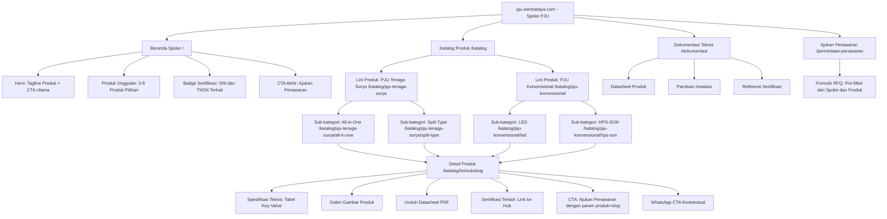
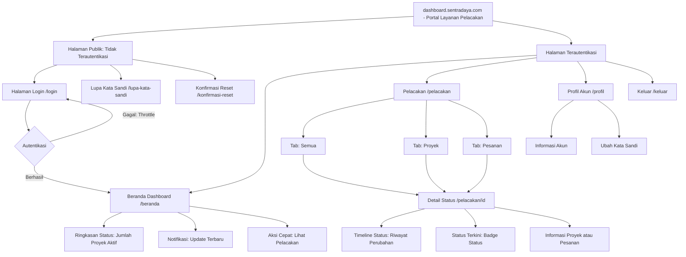

# Arsitektur Informasi — DBSN Digital Ecosystem
## Bagian 2: Sitemap Hub, Spoke, & Dashboard

**Proyek:** DBSN Centralized Digital Ecosystem  
**Berbasis:** PRD v3.0 + Jawaban Klarifikasi IA  

---

## 3. Sitemap Hub (sentradaya.com)

Hub berfungsi sebagai **Pusat Kepercayaan Korporat** — tempat utama untuk validasi legalitas, portofolio, dan routing ke spoke produk.

```mermaid
flowchart TD
    HUB["sentradaya.com - Hub"]

    HUB --> HOME["Beranda /"]
    HUB --> ABOUT["Tentang Kami /tentang-kami"]
    HUB --> CERT["Pusat Sertifikasi /sertifikasi"]
    HUB --> PORT["Portofolio Proyek /portofolio"]
    HUB --> PROD["Produk Kami /produk"]
    HUB --> RFQ["Ajukan Penawaran /permintaan-penawaran"]
    HUB --> CONTACT["Hubungi Kami /hubungi-kami"]

    HOME --> H1["Hero + Routing CTA"]
    HOME --> H2["Trust Badge Bar: SNI TKDN LKPP ISO"]
    HOME --> H3["Grid Navigasi ke Spoke"]
    HOME --> H4["Highlight Portofolio Unggulan"]
    HOME --> H5["CTA Akhir: Ajukan Penawaran"]

    ABOUT --> A1["Profil Perusahaan /tentang-kami/profil"]
    ABOUT --> A2["Visi dan Misi /tentang-kami/visi-misi"]
    ABOUT --> A3["Tim Manajemen /tentang-kami/tim"]

    CERT --> C1["Sertifikat SNI /sertifikasi/sni"]
    CERT --> C2["Sertifikat TKDN /sertifikasi/tkdn"]
    CERT --> C3["Registrasi LKPP /sertifikasi/lkpp"]
    CERT --> C4["Sertifikat ISO /sertifikasi/iso"]
    CERT --> C5["Dokumen Lainnya /sertifikasi/lainnya"]
    C1 --> CD["Detail Sertifikat /sertifikasi/tipe/slug - Metadata dan Unduh"]
    C2 --> CD
    C3 --> CD
    C4 --> CD

    PORT --> PF["Filter: Pemerintah - BUMN - Swasta - EPC"]
    PF --> PD["Detail Proyek /portofolio/slug"]

    PROD --> PR1["PJU -> pju.sentradaya.com"]
    PROD --> PR2["Panel Surya -> solarcell.sentradaya.com"]
    PROD --> PR3["Penangkal Petir -> alatpetir.sentradaya.com"]
    PROD --> PR4["Baterai -> baterai.sentradaya.com"]

    RFQ --> RS["Pemilihan Segmen"]
    RS --> RG["Formulir B2G: Nama Proyek, Ref DIPA, Kuantitas, Jadwal, Jenis Pengadaan"]
    RS --> RB["Formulir B2B: Produk, Lingkup, Kuantitas, Jadwal, Kontak"]

    CONTACT --> CT1["Informasi Kontak"]
    CONTACT --> CT2["Formulir Kontak Umum"]
    CONTACT --> CT3["Peta Lokasi"]
```



### Penjelasan Struktur Hub

| Halaman | Tujuan | Target Segmen |
|---------|--------|---------------|
| **Beranda** | Routing utama + sinyal kepercayaan awal | Semua |
| **Tentang Kami** | Profil korporat, visi misi, tim — membangun kredibilitas | B2G (primer) |
| **Pusat Sertifikasi** | Akses matriks sertifikasi berdasarkan tipe (SNI/TKDN/LKPP/ISO) | B2G (kritis) |
| **Portofolio Proyek** | Referensi proyek terstruktur dengan filter sektor | B2G + B2B |
| **Produk Kami** | Mega menu routing ke spoke sub-domain | Semua |
| **Ajukan Penawaran** | Formulir RFQ tersegmentasi (B2G/B2B) | Semua (konversi) |
| **Hubungi Kami** | Kontak, lokasi, formulir umum | Semua |

---

## 4. Sitemap Spoke Representatif ([produk].sentradaya.com)

Template spoke ini berlaku untuk **semua klaster produk** (PJU, Panel Surya, Penangkal Petir, Baterai, dan spoke masa depan). Contoh menggunakan PJU.

### 4.1 Hirarki Halaman Spoke



### 4.2 Struktur URL Spoke (3 Level)

```
[spoke].sentradaya.com/
├── /                                          → Beranda Spoke
├── /katalog                                   → Semua Lini Produk
│   ├── /katalog/[lini-produk]                 → Level 1: Lini Produk
│   │   ├── /katalog/[lini]/[sub-kategori]     → Level 2: Sub-kategori
│   │   │   └── /katalog/[lini]/[sub]/[slug]   → Level 3: Detail Produk (PDP)
├── /dokumentasi                               → Perpustakaan Teknis
├── /permintaan-penawaran                      → Formulir RFQ (pre-fill)
```

### 4.3 Komponen PDP (Product Detail Page)

PDP adalah halaman konversi kunci. Setiap PDP harus memiliki:

| Komponen | Deskripsi | Posisi |
|----------|-----------|--------|
| **Breadcrumb** | Beranda > Katalog > Lini > Sub-kategori > Produk | Atas |
| **Judul Produk** | H1 dengan nama produk | Atas |
| **Galeri Gambar** | Carousel gambar produk | Atas (kiri di desktop) |
| **Spesifikasi Teknis** | Tabel key-value dari Sanity | Atas (kanan di desktop) |
| **Deskripsi Lengkap** | Portable text dari CMS | Tengah |
| **Unduh Datasheet** | Tombol download PDF (GA4: file_download) | Tengah |
| **Sertifikasi Terkait** | Kartu link ke TKDN/SNI di Hub | Bawah |
| **CTA Penawaran** | Tombol primary → /permintaan-penawaran?produk=slug | Bawah (sticky mobile) |
| **WhatsApp CTA** | Floating button kontekstual | Fixed kanan bawah |

---

## 5. Sitemap Dashboard (dashboard.sentradaya.com)

Dashboard adalah **surface operasional tertutup** untuk klien B2B/B2G yang telah terkualifikasi. Phase 1 hanya mencakup pelacakan status.



### 5.1 Struktur URL Dashboard

```
dashboard.sentradaya.com/
├── /login                     → Halaman login (publik)
├── /lupa-kata-sandi           → Reset password (publik)
├── /beranda                   → Overview dashboard (auth)
├── /pelacakan                 → Daftar pelacakan + filter tab (auth)
│   └── /pelacakan/[id]        → Detail status proyek/pesanan (auth, row-level)
├── /profil                    → Profil dan ubah kata sandi (auth)
├── /keluar                    → Logout action
```

### 5.2 Status Pelacakan (Phase 1)

| Status | Deskripsi | Warna Badge |
|--------|-----------|-------------|
| **Diterima** | RFQ/pesanan diterima | Abu-abu |
| **Diproses** | Sedang diproses tim internal | Biru |
| **Produksi** | Dalam tahap produksi | Kuning |
| **Pengiriman** | Dalam pengiriman | Oranye |
| **Selesai** | Proyek/pesanan selesai | Hijau |
| **Ditunda** | Ditunda sementara | Merah |

> **Phase 2 (ditunda):** Unduh dokumen (faktur, kontrak, surat jalan) dari dalam dashboard.

---

> **Dokumen sebelumnya:** [Bagian 1 — Strategi & Navigasi](./ia-strategy-navigation.md)  
> **Dokumen selanjutnya:** [Bagian 3 — Alur Pengguna Inti](./ia-user-flows.md)
