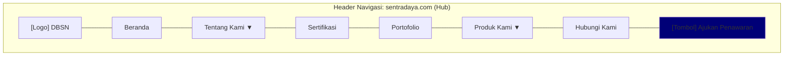
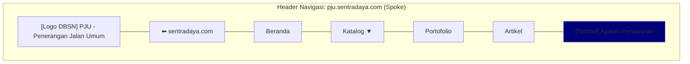

# Arsitektur Informasi — DBSN Digital Ecosystem
## Bagian 1: Strategi IA & Sistem Navigasi Global

**Proyek:** DBSN Centralized Digital Ecosystem — sentradaya.com  
**Versi:** 1.0  
**Tanggal:** 2026-04-24  
**Berbasis:** PRD v3.0  
**Status:** Final Draft — Siap untuk Tim UI/UX

---

## 1. Strategi & Prinsip IA

### 1.1 Model Hub-and-Spoke

Arsitektur Informasi ini dibangun di atas model **Hub-and-Spoke** yang melayani dua segmen pengguna utama dengan kebutuhan yang berbeda secara fundamental:

| Aspek | B2G (Pemerintah) | B2B (Swasta) |
|-------|-------------------|--------------| 
| **Mindset** | Trust-first (Validasi Kepatuhan) | Efficiency-first (Riset Spesifikasi) |
| **Prioritas IA** | Sertifikasi & Portofolio di navigasi utama | Akses langsung ke Spoke & PDP |
| **Titik Masuk Utama** | Hub (sentradaya.com) | Spoke langsung via SEO/kampanye |
| **Konversi** | Formulir RFQ B2G (formal, terstruktur) | Formulir RFQ B2B atau WhatsApp |
| **Pasca-RFQ** | Dashboard Pelacakan Proyek | Dashboard Pelacakan Pesanan |

### 1.2 Prinsip Desain IA

1. **Prominensi Sinyal Kepercayaan** — Sertifikasi dan Portofolio adalah navigasi utama (bukan sub-halaman tersembunyi)
2. **Akses Sertifikasi Matriks** — Diorganisir berdasarkan *tipe* di Hub (untuk validasi B2G), berdasarkan *produk* di Spoke (untuk verifikasi kontekstual)
3. **Template Spoke Skalabel** — Setiap spoke mengikuti struktur IA identik; diferensiasi hanya melalui konten CMS
4. **Kedalaman Produk 3 Level** — Beranda Spoke → Lini Produk → Sub-kategori → Detail Produk (PDP)
5. **Halaman RFQ Mandiri** — Halaman `/permintaan-penawaran` yang menerima parameter URL untuk pre-fill produk
6. **Pelabelan Bahasa Indonesia** — Semua label navigasi menggunakan Bahasa Indonesia formal dan profesional
7. **WhatsApp Non-Blocking** — CTA floating tersedia di semua halaman, tidak menghalangi formulir RFQ di mobile

---

## 2. Sistem Navigasi Global

### 2.1 Header — Hub (sentradaya.com)



| Item Navigasi | Tipe | Perilaku |
|---------------|------|----------|
| **Beranda** | Link | → `/` |
| **Tentang Kami** | Dropdown | → Profil Perusahaan, Visi & Misi, Tim Manajemen |
| **Sertifikasi** | Link | → `/sertifikasi` (Pusat Sertifikasi & Legalitas) |
| **Portofolio** | Link | → `/portofolio` |
| **Produk Kami** | Mega Menu | Grid kartu spoke: PJU, Panel Surya, Penangkal Petir, Baterai |
| **Hubungi Kami** | Link | → `/hubungi-kami` |
| **Ajukan Penawaran** | CTA Button (Primary) | → `/permintaan-penawaran` |

**Mobile:** Hamburger menu → drawer kiri dengan item yang sama, CTA sticky di bawah drawer.

---

### 2.2 Header — Spoke ([produk].sentradaya.com)



| Item Navigasi | Tipe | Perilaku |
|---------------|------|----------|
| **← sentradaya.com** | Back Link | → Hub root domain (navigasi cross-domain) |
| **Beranda** | Link | → `/` (beranda spoke) |
| **Katalog Produk** | Dropdown | → Daftar Lini Produk dengan sub-kategori |
| **Portofolio** | Link | → `/portofolio` (portofolio proyek spoke) |
| **Artikel** | Link | → `/artikel` (artikel dan konten spoke) |
| **Ajukan Penawaran** | CTA Button (Primary) | → `/permintaan-penawaran` |

**Mobile:** Hamburger menu. Back-link ke Hub selalu visible di atas.

---

### 2.3 Header — Dashboard (dashboard.sentradaya.com)

```mermaid
---
config:
  layout: dagre
---
flowchart TB
 subgraph HEADER_DASHBOARD["Header Navigasi: dashboard.sentradaya.com (Bagian 2.3)"]
    direction LR
        DH_LOGO["[Logo DBSN] Layanan Pelacakan"]
        DH_NAV1["Beranda"]
        DH_NAV2["Pelacakan"]
        DH_NAV3["Profil Akun"]
        DH_SPACE["           "] %% Spacer untuk memisahkan menu kiri dan kanan
        DH_USER["[Nama User]"]
        DH_LOGOUT["[Aksi] Keluar"]
 end

    %% Mengunci urutan layout dari kiri ke kanan
    DH_LOGO --- DH_NAV1 --- DH_NAV2 --- DH_NAV3 --- DH_SPACE --- DH_USER --- DH_LOGOUT
    
    style DH_USER fill:#007
    style DH_LOGOUT fill:#dc3545
```

| Item Navigasi | Tipe | Perilaku |
|---------------|------|----------|
| **Beranda** | Link | → `/beranda` (overview dashboard) |
| **Pelacakan** | Link | → `/pelacakan` (daftar proyek/pesanan) |
| **Profil Akun** | Link | → `/profil` |
| **Keluar** | Action | Logout → redirect ke halaman login |

> Dashboard **tidak** memiliki navigasi ke Hub atau Spoke. Ini adalah surface operasional tertutup, bukan marketing.

---

### 2.4 Footer Global (Seluruh Platform)

Footer digunakan secara konsisten di Hub dan semua Spoke. Dashboard menggunakan versi minimal.

| Kolom | Konten |
|-------|--------|
| **Tentang DBSN** | Deskripsi singkat perusahaan, logo |
| **Produk Kami** | Link ke semua spoke: PJU, Panel Surya, Penangkal Petir, Baterai |
| **Sertifikasi** | Link langsung: SNI, TKDN, LKPP, ISO |
| **Hubungi Kami** | Alamat, telepon, email, jam operasional |
| **Ikuti Kami** | Ikon media sosial (SVG) |
| **Legal** | Kebijakan Privasi - Syarat & Ketentuan |

---

### 2.5 Elemen Persisten

| Elemen | Lokasi | Perilaku |
|--------|--------|----------|
| **WhatsApp Floating CTA** | Kanan bawah, semua halaman Hub & Spoke | Collapse/reposition saat formulir RFQ aktif di mobile. GA4: whatsapp_click |
| **Breadcrumb** | Di bawah header, semua halaman kecuali Beranda | Format: Beranda > Katalog > Lini > Sub-kategori > Produk |
| **Trust Badge Bar** | Beranda Hub & Beranda Spoke | Strip horizontal: logo SNI, TKDN, LKPP, ISO |
| **CTA Banner Akhir** | Sebelum footer, semua halaman konten | "Butuh penawaran? Ajukan sekarang" → /permintaan-penawaran |

---

> **Dokumen selanjutnya:** [Bagian 2 — Sitemap Hub, Spoke, & Dashboard](./ia-sitemaps.md) dan [Bagian 3 — Alur Pengguna Inti](./ia-user-flows.md)
