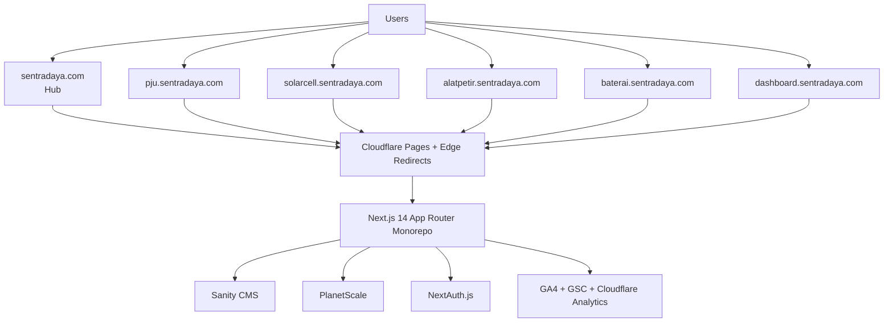

# DBSN Centralized Digital Ecosystem (Hub-and-Spoke)

> **Internal Use Only — Confidential**  
> This repository contains internal planning and architecture documentation for DBSN’s unified digital ecosystem initiative.

## Overview

This project defines the target architecture and product requirements for consolidating DBSN’s legacy web properties into a single **Hub-and-Spoke** ecosystem.

The platform is designed to:
- Consolidate SEO authority from legacy domains into one unified ecosystem.
- Improve trust signals for government and B2B procurement journeys.
- Introduce structured conversion paths (RFQ + WhatsApp fallback).
- Provide secure post-RFQ tracking through a dedicated client dashboard.

Primary references used in this repository:
- `.taskmaster/docs/prd/prd-v3.md`
- `.taskmaster/docs/architecture/architecture.md`
- `.taskmaster/docs/bussiness-context/DBSN_Bussiness-Context.md`

## Hub-and-Spoke Domains

### Primary Hub
- **`sentradaya.com`** — corporate trust center (company profile, certifications, portfolio, spoke routing CTAs)

### Product Spokes
- **`pju.sentradaya.com`** — PJU / street lighting product cluster
- **`solarcell.sentradaya.com`** — solar cell / PLTS product cluster
- **`alatpetir.sentradaya.com`** — lightning protection product cluster
- **`baterai.sentradaya.com`** — battery/energy storage spoke (extensible)

### Secure Operational Spoke
- **`dashboard.sentradaya.com`** — authenticated client portal for tracking services (project/order status)

## Features

### Hub Features (`sentradaya.com`)
- Corporate trust center and brand unification surface.
- Certifications and compliance documentation access (SNI/TKDN/LKPP context).
- Cross-sector portfolio navigation with contextual spoke routing.
- Segment-aware routing for Government (B2G) and Private (B2B) user journeys.

### Spoke Features (Product Sub-domains)

#### `pju.sentradaya.com` (PJU / Street Lighting)
- Street-lighting-focused product cluster surface.
- Product/specification pages and RFQ pathway for PJU-related procurement.

#### `solarcell.sentradaya.com` (Solar Cell / PLTS)
- Solar-focused product cluster for private and government project discovery.
- Technical document and inquiry pathways aligned to PLTS decision journeys.

#### `alatpetir.sentradaya.com` (Lightning Protection)
- Lightning-protection product cluster and supporting inquiry flow.
- Contextual path to certifications/portfolio trust assets from the hub ecosystem.

#### `baterai.sentradaya.com` (Battery / Energy Storage, Extensible)
- Dedicated spoke model for battery and storage-oriented catalog growth.
- Extensible spoke pattern for future data-driven category expansion.

#### Shared Spoke Capabilities
- Data-driven content model (no spoke-specific code forks).
- Product detail pages with technical specifications and documentation pathways.
- Structured RFQ entry points with segmented form variants (B2G/B2B).
- Persistent WhatsApp CTA integrated as a parallel conversion path.

### Conversion & Operations Features
- Centralized RFQ ingestion pipeline (`/api/rfq`) with attribution metadata.
- Resend + Telegram notification workflow for lead operations.
- Graceful fallback mechanism to pre-filled WhatsApp when RFQ infrastructure fails.
- SEO migration support via edge-level 301 redirect resolution (`redirect_map` strategy).

### Secure Dashboard Features (`dashboard.sentradaya.com`)
- NextAuth-based authenticated access.
- Client-scoped tracking visibility for project/order status.
- Role-aware access model aligned with `admin`, `viewer`, and `client` roles.

## Architecture Overview

The ecosystem follows a centralized **Hub-and-Spoke** architecture delivered from a single monorepo, with shared UI tokens, shared content contracts, and shared transactional data services.



## Tech Stack

Locked stack (per architecture/PRD docs):

- **Frontend Runtime:** Next.js 14+ (App Router)
- **Monorepo:** Turborepo
- **CMS:** Sanity.io
- **UI System:** Tailwind CSS + Radix UI
- **Transactional Data:** PlanetScale (MySQL-compatible)
- **Authentication:** NextAuth.js
- **Hosting & Edge:** Cloudflare Pages (+ edge redirect handling)
- **Notifications:** Resend + Telegram Bot API
- **Telemetry:** GA4 + GSC + Cloudflare Analytics

## Installation

> This repository currently contains planning/architecture documentation artifacts. Runtime app scaffolding files (`package.json`, `turbo.json`, `apps/*`) are not present in the current workspace snapshot.

1. Clone the repository:

```bash
git clone <internal-repo-url>
cd awesome-website-test
```

2. Open in your editor:

```bash
code .
```

3. Start with these docs:
- `.taskmaster/docs/bussiness-context/DBSN_Bussiness-Context.md`
- `.taskmaster/docs/prd/prd-v3.md`
- `.taskmaster/docs/architecture/architecture.md`

<!-- TODO: Add concrete runtime install steps after monorepo bootstrap files are committed. -->

## Development (Turborepo Workflow)

Target development model is a Turborepo monorepo with shared packages and apps.

Expected workflow (to be validated against real root config once committed):

```bash
# Install dependencies
npm install

# Run all development targets via Turborepo
npx turbo run dev

# Build all packages/apps
npx turbo run build

# Run linting
npx turbo run lint

# Run tests
npx turbo run test
```

<!-- TODO: Verify script names and package manager from actual package.json/turbo.json. -->
<!-- TODO: Document concrete apps/ and packages/ layout once source code is present. -->

## Testing & CI/CD

Architecture and PRD documents define quality gates around:
- RFQ fallback simulation under forced failure
- Sub-domain routing verification
- Redirect coverage audit (no unresolved legacy 404 in migration window)
- Performance gates (PSI 90+ on key templates)

<!-- TODO: Add actual CI/CD workflow badges and pipeline commands after `.github/workflows` or equivalent config is available. -->
<!-- TODO: Add concrete test framework commands once test runner configuration is committed. -->

## Strategic Goals Alignment

This initiative aligns with the Strategic Intelligence Report directives to:
- Consolidate fragmented legacy domains into a unified authority system.
- Strengthen B2G/B2B trust infrastructure (certifications, portfolio, compliance visibility).
- Improve qualified conversion via structured RFQ architecture.
- Preserve SEO equity through controlled 301 migration and canonical discipline.
- Enable secure self-service post-RFQ tracking via `dashboard.sentradaya.com`.

## Repository Structure (Current Snapshot)

```text
.
├── README.md
├── .taskmaster/
│   ├── config.json
│   └── docs/
│       ├── architecture/
│       ├── bussiness-context/
│       └── prd/
└── memory-bank/
```

## Security & Confidentiality

All contents are intended for internal DBSN planning and implementation alignment.  
Do not distribute outside authorized teams.